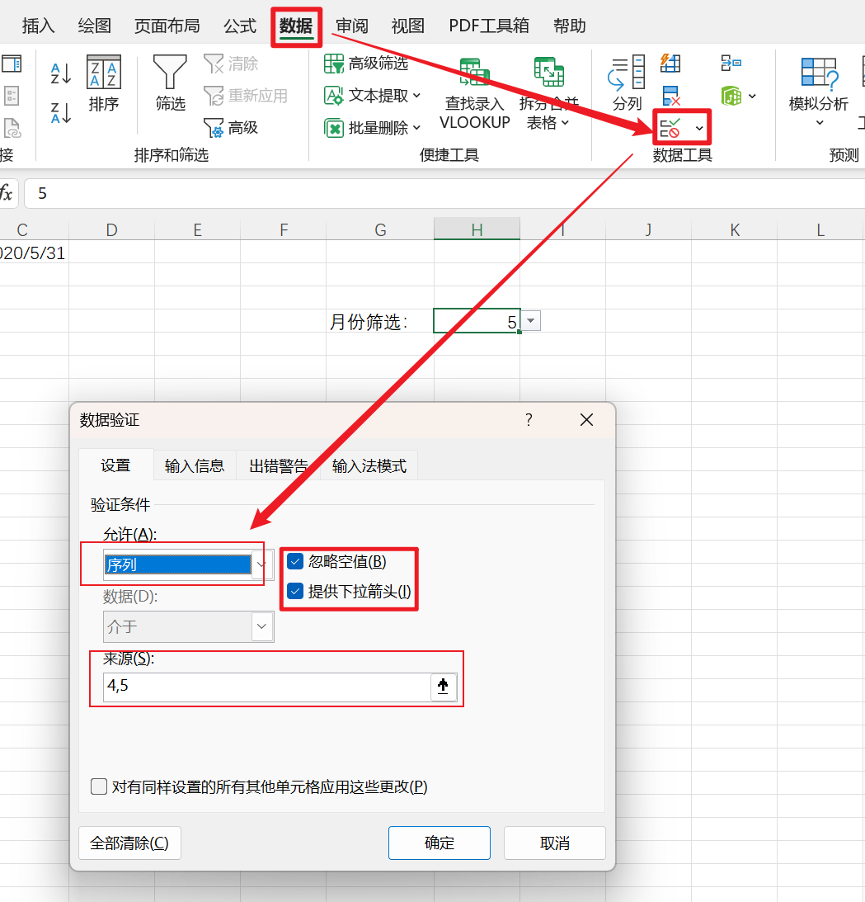
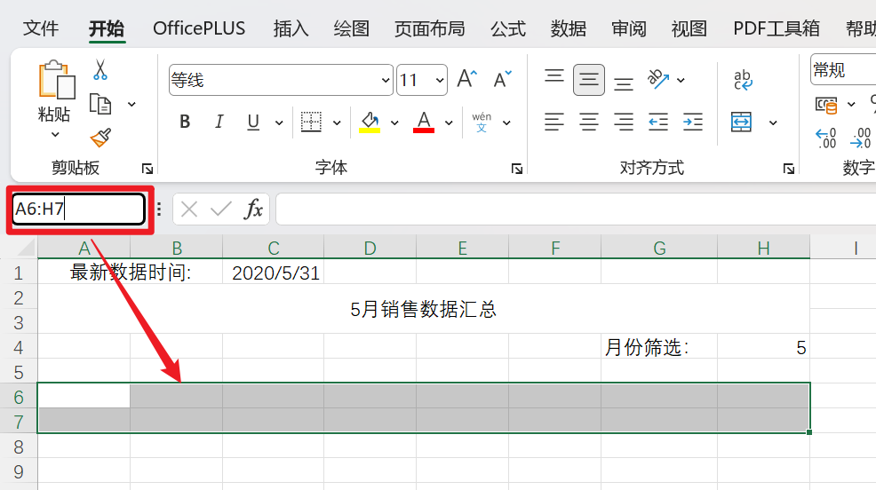
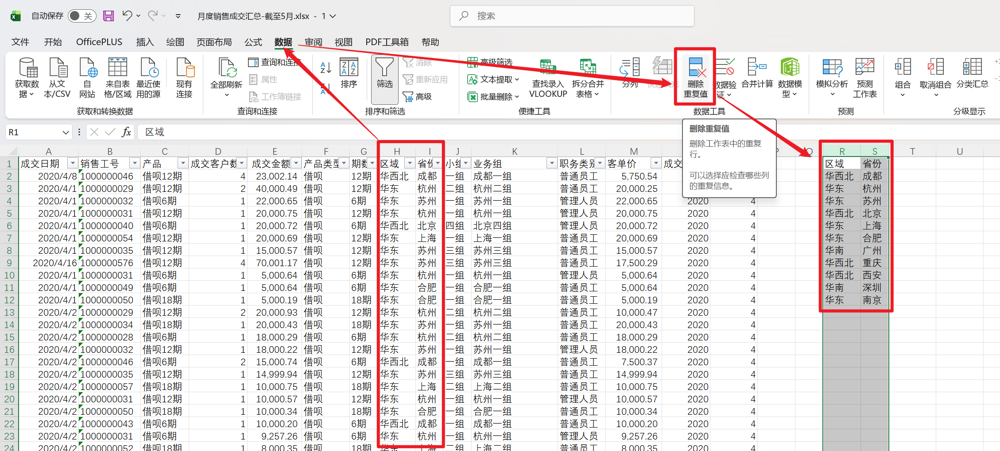
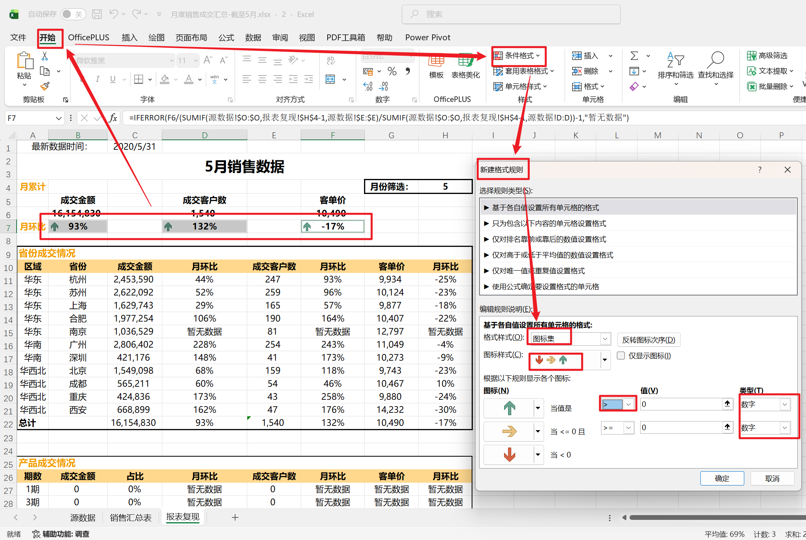
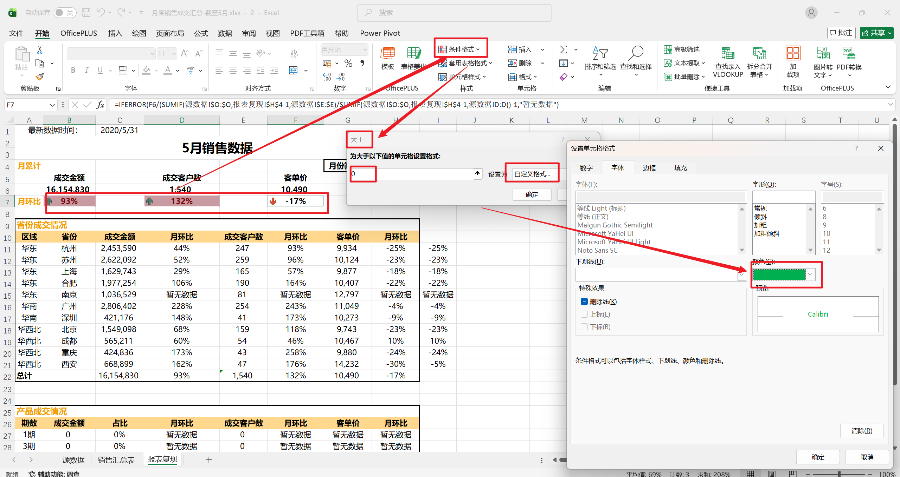
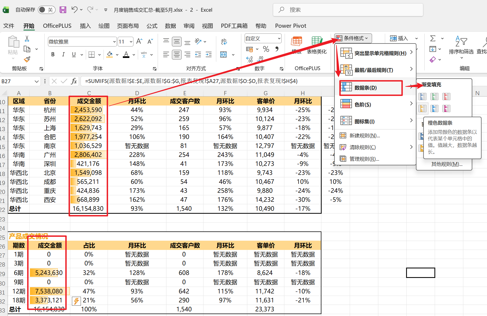
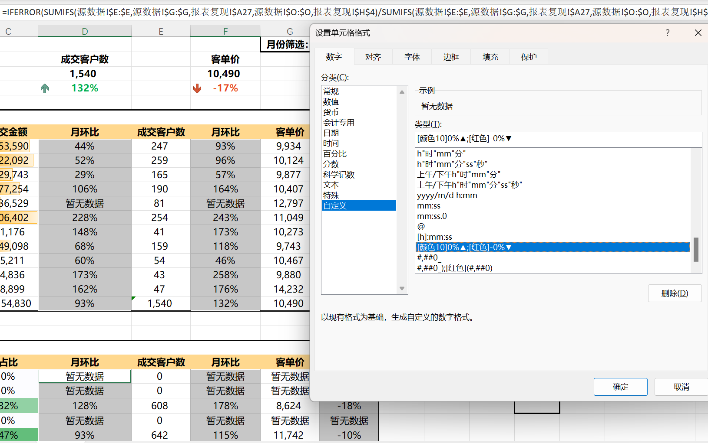
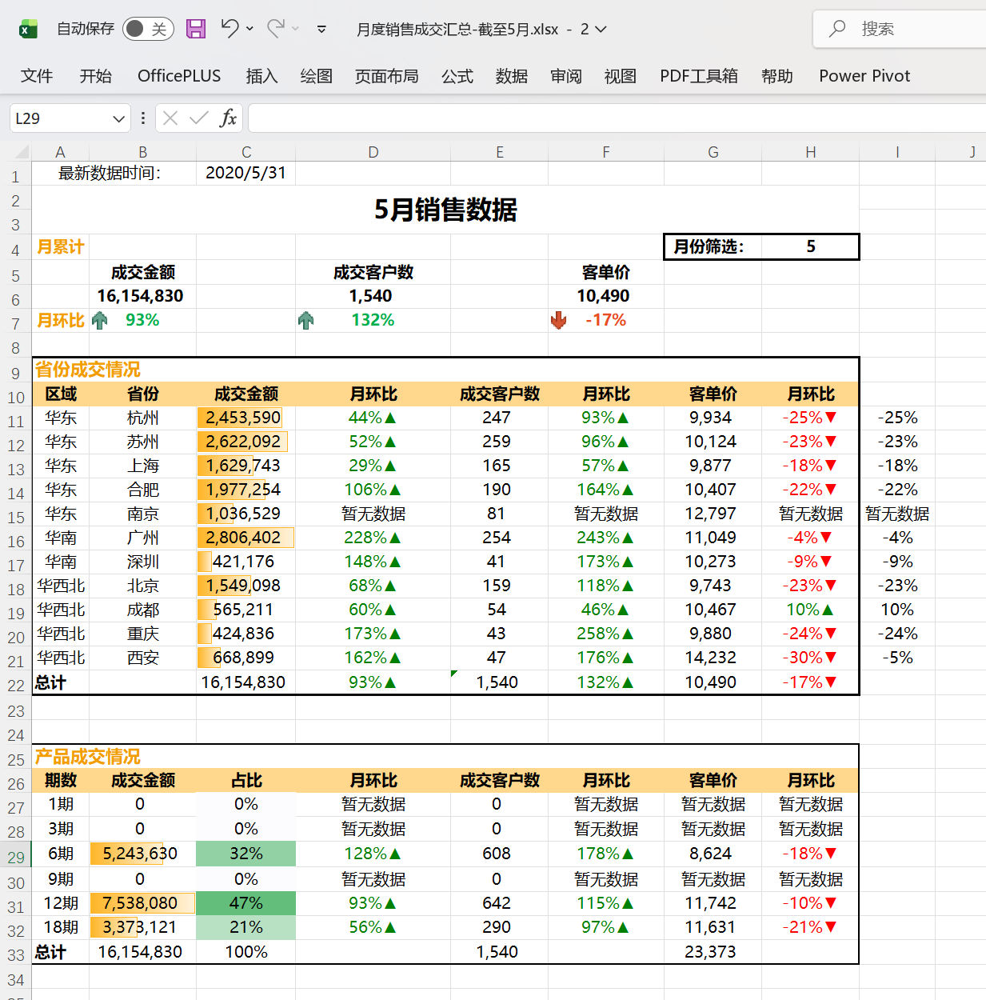

### **Excel 中的聚合函数家族以 SUM 为核心，延伸出计数、均值、极值、排位等一系列统计函数。**

---

### **基础聚合函数**

这些是日常使用频率最高的一组，功能直接、语法简单。

**SUM** — 求和，将范围内所有数值相加
```
=SUM(E2:E100)
```

**COUNT / COUNTA / COUNTBLANK** — 计数三兄弟
- `COUNT`：只统计范围内**数字**单元格的数量
- `COUNTA`：统计范围内**非空**单元格的数量（包括文本）
- `COUNTBLANK`：统计范围内**空白**单元格的数量

```
=COUNT(E2:E100)
=COUNTA(A2:A100)
=COUNTBLANK(A2:A100)
```

**AVERAGE** — 算术平均值
```
=AVERAGE(E2:E100)
```

**MAX / MIN** — 最大值与最小值
```
=MAX(E2:E100)
=MIN(E2:E100)
```

**MEDIAN** — 中位数，将数据从小到大排列后取中间值，比 AVERAGE 更能抵抗极端值的干扰
```
=MEDIAN(E2:E100)
```

**MODE** — 众数，返回出现频率最高的值
```
=MODE(E2:E100)
```

---

### **进阶聚合函数**

**LARGE / SMALL** — 第 N 大值和第 N 小值，比 MAX/MIN 更灵活
```
=LARGE(E2:E100, 2)   '第2大的值
=SMALL(E2:E100, 3)   '第3小的值
```

**RANK** — 返回某个数值在范围内的排名
```
=RANK(E2, E$2:E$100, 0)   '0为降序，1为升序
```

**SUBTOTAL** — 对可见单元格聚合，在筛选状态下只计算**筛选后显示的行**，而 SUM 等函数会把隐藏行也算进去。第一个参数是功能代码：

| 代码 | 功能           |
| ---- | -------------- |
| 9    | SUM 求和       |
| 1    | AVERAGE 平均值 |
| 2    | COUNT 计数     |
| 4    | MAX 最大值     |
| 5    | MIN 最小值     |

```
=SUBTOTAL(9, E2:E100)   '只对筛选可见行求和
```

**AGGREGATE** — SUBTOTAL 的增强版，支持更多功能代码，还可以选择忽略错误值、忽略隐藏行等，适合数据质量不稳定的场景。

---

### **统计分布类函数**

当需要对数据做更深入的统计分析时，这一组函数非常有用。

**STDEV / STDEVP** — 标准差，衡量数据的离散程度
- `STDEV`：基于样本计算
- `STDEVP`：基于整体总体计算

**VAR / VARP** — 方差，与标准差类似，是标准差的平方

**PERCENTILE** — 百分位数，返回数据中处于指定百分比位置的值
```
=PERCENTILE(E2:E100, 0.9)   '返回第90百分位的值
```

---

### **与条件聚合函数的关系**

上一节讲到的 SUMIF、COUNTIF、AVERAGEIF 等，本质上就是在这些基础聚合函数的基础上**加入了条件筛选能力**。可以把它们理解为同一家族的两个层次：基础聚合函数处理全量数据，条件聚合函数处理符合特定条件的子集数据。两者语法高度相似，学会一层之后另一层自然融会贯通。在实际报表开发中，这两类函数几乎总是配合使用，共同构成数据汇总分析的核心工具链。


### **在 Excel 中，`Ctrl + Shift + L` 用于开启或关闭筛选功能（自动筛选）。**

选中数据区域后按下此快捷键，Excel 会在表头行自动添加下拉筛选箭头，方便你按条件过滤数据；再次按下则取消筛选，恢复原始视图。

这个快捷键等同于菜单路径：**数据 → 筛选**，是日常数据处理中非常高频的操作之一。需要注意的是，如果当前已有筛选条件，再次按下 `Ctrl + Shift + L` 会直接移除所有筛选并清除已设置的条件，使用时需留意。





这张图片展示的是在 Excel 中为单元格设置**数据验证（序列下拉菜单）**的完整操作过程，结合图中的红色箭头标注，可以分为以下几个层次来理解：

---

### **第一步：进入数据验证入口**

图片顶部红色箭头指向的是 Excel 菜单栏中的 **"数据"** 选项卡，在其右侧区域的 **"数据工具"** 组中，有一个"数据验证"按钮（图标为表格加漏斗样式）。点击该按钮即可打开数据验证对话框。

---

### **第二步：配置数据验证对话框**

打开后进入的是 **"数据验证"** 对话框，当前停留在 **"设置"** 选项卡。图中红框标注了三个关键配置项：

**验证条件 - 允许：序列**
在"允许"下拉框中选择了 **"序列"**，这意味着该单元格只允许用户从一个预设的列表中选择值，而不能随意输入。

**勾选"忽略空值"和"提供下拉箭头"**
- **忽略空值**：当单元格为空时不触发错误提示，允许留空。
- **提供下拉箭头**：这是序列验证的核心体验，勾选后单元格右侧会出现一个小箭头，用户点击即可展开选项列表进行选择，交互更直观。

**来源：4,5**
在"来源"输入框中填写了 `4,5`，表示下拉列表中只有 **4** 和 **5** 两个选项。多个选项之间用英文逗号 `,` 分隔。结合图片左上角单元格中显示的 **"月份筛选：5"**，可以判断这个下拉菜单是用来让用户选择月份的（此处仅提供了 4 月和 5 月两个选项）。

---

### **整体效果**

完成设置并点击"确定"后，目标单元格就会变成一个下拉选择框。用户点击单元格旁的箭头，可以从列表中选择 `4` 或 `5`，若手动输入其他值则会触发错误提示（可在"出错警告"选项卡中自定义提示内容）。

这种做法在制作报表、交互式看板或数据录入表单时非常实用，能有效规范输入内容、减少人为错误。




名称框：使用：语法可以快速选中相关区域


`=H4&"月销售数据汇总"`

### **这是 Excel 中的文本连接公式，用于将单元格内容与固定文字拼接成一个字符串。**

---

### **语法拆解**

这个公式由两部分通过 `&` 运算符连接而成：

| 部分               | 含义                         |
| ------------------ | ---------------------------- |
| `=H4`              | 引用 H4 单元格的值           |
| `&`                | 文本连接运算符               |
| `"月销售数据汇总"` | 用双引号包裹的固定文本字符串 |

---

### **`&` 运算符详解**

`&` 是 Excel 中专门用于**拼接文本**的运算符，作用等同于 `CONCATENATE()` 函数。它可以将任意数量的单元格引用、文本字符串、数字混合连接在一起，且不限制连接项的数量，例如 `=A1&B1&"文字"&C1` 完全合法。

需要特别注意的是，**直接写入公式的文字必须用英文双引号 `""` 包裹**，否则 Excel 会将其识别为单元格名称或函数名而报错；而单元格引用（如 `H4`）则直接书写，不需要引号。

---

### **实际效果示例**

结合上图的场景，假设 H4 单元格的值为 `5`，那么该公式的结果就是：

> **`5月销售数据汇总`**

如果 H4 的值改为 `3`，结果则自动变为 `3月销售数据汇总`。这种动态拼接的方式非常适合制作**随筛选条件自动更新的标题**，避免手动修改文字内容。

---

### **扩展用法**

`&` 可以连接多个部分，例如：

```
="第"&H4&"月销售数据汇总（"&YEAR(TODAY())&"年）"
```

若 H4 为 `5`，当前年份为 2026，结果则为：`第5月销售数据汇总（2026年）`，灵活度极高。


`=SUMIF(源数据!O:O,报表复现!H4,源数据!E:E)`

### **这是一个跨工作表的条件求和公式，含义是：在"源数据"表的 O 列中查找等于"报表复现"表 H4 单元格值的行，并将对应的"源数据"表 E 列数值加总。**

---

### **SUMIF 函数基本语法**

```
=SUMIF(range, criteria, sum_range)
```

我要找哪个表中的是什么数值，和什么表中的数值去对应，如果需要求和 求和的是那一列

要计算成交金额，并且要和月份筛选所匹配，所以要去源数据表中找到成交月份这列，匹配条件是报表复现这个表中月份筛选所对应的值，需要求和，对源数据表中成交金额这一列全列求和

三个参数依次为：

| 参数        | 对应内容      | 含义                       |
| ----------- | ------------- | -------------------------- |
| `range`     | `源数据!O:O`  | 用于判断条件的搜索范围     |
| `criteria`  | `报表复现!H4` | 匹配条件（判断依据）       |
| `sum_range` | `源数据!E:E`  | 满足条件后实际求和的数据列 |

---

### **跨工作表引用语法详解**

公式中出现了 `源数据!O:O` 和 `报表复现!H4` 这样的写法，这是 Excel **跨工作表引用**的标准格式：

> `工作表名称 ! 单元格或区域`

感叹号 `!` 是工作表名与单元格地址之间的分隔符。`源数据!O:O` 表示"源数据"这张工作表的整个 O 列，`报表复现!H4` 表示"报表复现"工作表中的 H4 单元格。如果工作表名称中含有空格或特殊字符，则需要用单引号包裹，例如 `'Sheet 1'!A1`。

---

### **公式完整逻辑**

结合上文的场景，H4 是一个月份下拉选择框（值为 `4` 或 `5`），因此这个公式的实际执行逻辑是：

1. 在"源数据"工作表的 **O 列**逐行扫描；
2. 找出所有值等于"报表复现"表 **H4 单元格**（即所选月份，如 `5`）的行；
3. 将这些行对应的 **E 列数值**全部累加，返回求和结果。

换句话说，它实现的效果是：**按月份筛选，自动汇总该月的销售数据**（E 列很可能存储的是销售金额或数量）。

---

### **动态联动的价值**

由于条件参数用的是单元格引用 `报表复现!H4` 而非固定值，当用户通过下拉菜单切换月份时，H4 的值随之改变，SUMIF 公式会**自动重新计算**，无需手动修改公式。这与之前设置的数据验证下拉菜单形成了完整的联动机制，是构建动态报表的经典组合方式。


### **在 Excel 中，`$` 符号用于锁定单元格引用的行或列，使公式在复制拖拽时不发生偏移；`F4` 键是快速切换锁定方式的快捷键。**

---

### **为什么需要锁定单元格**

在 Excel 中，公式默认使用**相对引用**，即当你把公式向下或向右拖拽复制时，引用的单元格地址会随之自动偏移。例如 `=A1` 向下拖一行变成 `=A2`，向右拖一列变成 `=B1`。这在大多数情况下很方便，但当某个引用需要**始终固定指向同一个单元格**时（比如固定的税率、汇率、月份参数等），就需要用 `$` 来锁定，否则公式拖拽后会引用错误的单元格。

---

### **`$` 的三种锁定方式**

`$` 可以加在列标和行号的前面，组合出三种不同的引用模式：

| 写法   | 名称     | 含义                                  |
| ------ | -------- | ------------------------------------- |
| `A1`   | 相对引用 | 行列均不锁定，拖拽时行列都会偏移      |
| `$A1`  | 锁定列   | 列固定为 A，行随拖拽偏移              |
| `A$1`  | 锁定行   | 行固定为第 1 行，列随拖拽偏移         |
| `$A$1` | 绝对引用 | 行列全部锁定，无论怎么拖拽始终指向 A1 |

---

### **结合实际场景理解**

以之前的 SUMIF 公式为例，假设你要在报表中对多个月份分别求和，公式写在不同行，而月份条件始终来自 H4，这时就应该写成 `$H$4`，确保公式无论复制到哪里，条件参数始终指向 H4，不会因为行列偏移而变成 H5、I4 等错误引用。

再举一个更典型的例子：做乘法表时，行方向的系数固定在第 1 行，列方向的系数固定在 A 列，公式就需要写成 `=$A2*B$1`，这样向右拖时 A 列不动，向下拖时第 1 行不动，完美实现整张乘法表的一次性填充。

---

### **`F4` 快捷键的使用方式**

手动输入 `$` 比较繁琐，`F4` 键可以在编辑公式时**一键循环切换**四种引用状态，顺序如下：

> `A1` → `$A$1` → `A$1` → `$A1` → `A1` → ……

操作方法是：在编辑栏中将光标定位到某个单元格引用上（或选中它），然后反复按 `F4`，引用方式就会按上述顺序循环切换，直到切换到你需要的形式为止。这比手动输入 `$` 要高效得多，是实际工作中非常常用的技巧。

---

### **一个容易忽略的细节**

`$` 锁定的是**引用地址**，而不是单元格的值。被锁定的单元格内容本身依然可以修改，公式只是保证始终引用那个固定位置。另外，在跨工作表引用中，`$` 同样适用，例如 `源数据!$E$2` 表示锁定"源数据"表的 E2 单元格，复制公式时该引用完全不会变动。


### **环比是与上一个相邻周期相比的变化率，同比是与去年同一周期相比的变化率。**

---

### **同比（Year-on-Year, YoY）**

同比衡量的是**与去年同一时间段**相比的增减幅度，用于消除季节性波动的干扰，反映长期趋势。

$$
同比增长率 = \frac{本期数值 - 上年同期数值}{上年同期数值} \times 100\%
$$

**举例：** 2026 年 3 月销售额为 120 万，2025 年 3 月销售额为 100 万，则：

$$
同比增长率 = \frac{120 - 100}{100} \times 100\% = 20\%
$$

说明今年 3 月比去年同期增长了 20%。同比适合用来判断业务是否在长周期维度上持续增长，比如年度报告、季报分析中最常见的就是同比数据。

---

### **环比（Month-on-Month / Period-on-Period, MoM）**

环比衡量的是**与紧邻的上一个周期**相比的变化率，反映短期内的动态变化趋势，周期可以是月、季度、周等。

$$
环比增长率 = \frac{本期数值 - 上期数值}{上期数值} \times 100\%
$$

**举例：** 2026 年 3 月销售额为 120 万，2026 年 2 月销售额为 110 万，则：

$$
环比增长率 = \frac{120 - 110}{110} \times 100\% \approx 9.09\%
$$

说明本月比上个月增长了约 9.09%。环比更适合捕捉短期波动，例如分析某次促销活动对当月销售的拉动效果。

---

### **两者的核心区别**

同比和环比的选用取决于分析目的。同比排除了季节因素的干扰，适合评估整体增长健康度；而环比则对近期变化更敏感，适合监控短期运营动态。在实际报表中，两者通常**同时呈现**，互为补充——同比告诉你"方向对不对"，环比告诉你"势头强不强"。


`=$B$6/SUMIF(源数据!$O:$O,报表复现!$H$4-1,源数据!$E:$E)-1`
$$
环比增长率 = \frac{本期数值 - 上期数值}{上期数值} \times 100\%
$$

上述公式可以转变为本期/上期 -1  在我们的表格中B6单元格计算的是成交金额，报表复现!$H$4-1我们将该月月份减一，就可以得到上个月的成交金额，即可进行计算。

因为我们的月份中只有两个月4 5，只能计算5月的月环比数值


成交客户数的月环比和成交金额的月环比十分相似 不赘述

客单价的月环比计算时需要想到四月的客单价就是四月的成交金额/四月的成交客户数

那么直接用公式`(SUMIF(源数据!$O:$O,报表复现!$H$4-1,源数据!$E:$E)/SUMIF(源数据!$O:$O,报表复现!$H$4-1,源数据!$D:$D)`  就可以表示四月客单价 这样五月客单价/四月客单价-1 就是环比增长


### **`IFERROR` 是 Excel 中的容错函数，当公式计算出错时返回你指定的替代值，而不是显示难看的错误代码。**

---

### **语法结构**

```
=IFERROR(value, value_if_error)
```

| 参数             | 含义                          |
| ---------------- | ----------------------------- |
| `value`          | 你实际要计算的公式            |
| `value_if_error` | 当 value 出错时显示的替代内容 |

---

### **套用到环比公式的实际写法**

以环比为例，原始公式是 `=(B4-B3)/B3`，当 B3 为空或为 0 时会报 `#DIV/0!` 错误，套上 IFERROR 后：

```
=IFERROR((B4-B3)/B3, "-")
```

当数据不足（比如第一个月没有上期数据可比）时，单元格会显示 `-`，而不是红色的错误提示，报表整体观感更加专业整洁。

同比公式同理：

```
=IFERROR((B4-D4)/D4, "-")
```

---

### **`"-"` 的选择**

`"-"` 是用双引号包裹的文本字符串，表示出错时显示一个短横线。这是财务和数据报表中最常见的占位符写法，直观传达"此处暂无数据"的含义。你也可以根据需要替换成其他内容：

- `""` — 显示空白，单元格看起来什么都没有
- `"暂无数据"` — 显示中文提示
- `0` — 显示数字 0（注意不加引号，否则是文本）

在你们只有两个月数据的场景下，`"-"` 是最合适的选择，既不影响后续数据填入后的自动计算，也不会让阅读者对空白产生困惑。

---

### **IFERROR 能捕获的错误类型**

IFERROR 可以拦截 Excel 中**所有类型**的错误，包括：

- `#DIV/0!` — 除以零
- `#VALUE!` — 数据类型不匹配
- `#REF!` — 引用了无效单元格
- `#N/A` — VLOOKUP 等函数找不到匹配值
- `#NAME?` — 函数名拼写错误
- `#NULL!` / `#NUM!` — 其他计算异常

所以 IFERROR 不仅适用于环比同比，在你之前用到的 SUMIF、VLOOKUP 等公式外层套上它，都是非常好的防错习惯。


### **Excel 中的条件聚合函数家族，核心是 SUMIF / SUMIFS，并延伸出 COUNTIF、AVERAGEIF 等一系列同结构函数。**

---

### **单条件系列：IF 结尾**

这一系列函数只支持**一个条件**，语法相对简洁，适合简单场景。

**SUMIF** — 条件求和（你已熟悉）
```
=SUMIF(条件范围, 条件, 求和范围)
```

**COUNTIF** — 条件计数，统计满足条件的单元格数量
```
=COUNTIF(条件范围, 条件)
```
例如统计 O 列中月份等于 5 的记录共有多少行：
```
=COUNTIF(源数据!O:O, 报表复现!H4)
```

**AVERAGEIF** — 条件平均值，对满足条件的数值求平均
```
=AVERAGEIF(条件范围, 条件, 平均值范围)
```
例如计算 5 月份的平均单笔销售额：
```
=AVERAGEIF(源数据!O:O, 报表复现!H4, 源数据!E:E)
```

**MAXIFS / MINIFS** — 条件最大值和最小值（Excel 2019 及以上版本支持）
```
=MAXIFS(最大值范围, 条件范围, 条件)
=MINIFS(最小值范围, 条件范围, 条件)
```
注意这两个函数参数顺序与 SUMIF 不同，**求值范围在前，条件范围在后**，容易混淆，需要留意。

---

### **多条件系列：IFS 结尾**

当需要同时满足**两个或更多条件**时，使用 IFS 结尾的版本，可以叠加任意数量的条件对。

**SUMIFS** — 多条件求和
```
=SUMIFS(求和范围, 条件范围1, 条件1, 条件范围2, 条件2, ...)
```
注意与 SUMIF 的关键区别：**SUMIFS 的求和范围在第一个参数**，而 SUMIF 的求和范围在最后。例如同时按月份和产品类别筛选销售额：
```
=SUMIFS(源数据!E:E, 源数据!O:O, H4, 源数据!P:P, H5)
```

**COUNTIFS** — 多条件计数
```
=COUNTIFS(条件范围1, 条件1, 条件范围2, 条件2, ...)
```

**AVERAGEIFS** — 多条件平均值
```
=AVERAGEIFS(平均值范围, 条件范围1, 条件1, 条件范围2, 条件2, ...)
```

---

### **条件写法的通用规则**

这些函数的条件参数写法完全一致，掌握一次即可通用：

| 写法             | 含义             | 示例            |
| ---------------- | ---------------- | --------------- |
| 直接引用单元格   | 等于该单元格的值 | `H4`            |
| 数字或文本       | 精确匹配         | `5` 或 `"北京"` |
| 比较运算符       | 大于、小于等     | `">100"`        |
| 通配符 `*`       | 匹配任意多个字符 | `"*手机*"`      |
| 通配符 `?`       | 匹配单个字符     | `"张?"`         |
| 运算符拼接单元格 | 动态比较条件     | `">"&H4`        |

---

### **与 IFERROR 的配合**

正如你之前处理环比公式的思路，这些函数在数据不完整时同样可能返回错误（尤其是 AVERAGEIF 在无匹配数据时会返回 `#DIV/0!`），统一套上 IFERROR 是良好习惯：

```
=IFERROR(AVERAGEIF(源数据!O:O, H4, 源数据!E:E), "-")
```

整个条件聚合函数家族的逻辑高度统一，熟练掌握 SUMIF 之后，其他函数基本可以触类旁通，差异仅在于参数顺序和功能侧重上。




快速删除重复数据 


---

### **参数顺序对比**

```
=SUMIF(条件范围, 条件, 求和范围)        ← 求和范围在最后
=SUMIFS(求和范围, 条件范围1, 条件1, …)  ← 求和范围在最前
```

这个顺序差异是实际使用中**最容易出错的地方**，尤其是从 SUMIF 切换到 SUMIFS 时，很多人习惯性地把求和范围写在最后导致结果错误。

---

### **为什么 SUMIFS 要把求和范围提前**

这是微软在设计时有意为之的——SUMIFS 支持无限叠加条件对（条件范围 + 条件），如果求和范围放在最后，函数就无法判断最后一个参数到底是"又一个条件"还是"求和范围"。放在第一位则结构清晰，后面所有参数都固定是成对的条件组合，解析起来没有歧义。

---

### **一个实用建议**

由于 SUMIFS 完全兼容单条件场景（只写一对条件范围和条件即可），很多有经验的 Excel 用户**直接只用 SUMIFS**，放弃 SUMIF，这样就不用在两种参数顺序之间来回切换，减少出错概率。


`=SUMIFS(源数据!$E:$E,源数据!$I:$I,报表复现!$B11,源数据!$O:$O,报表复现!$H$4)`

存在多个匹配条件

`源数据!$E:$E`这是sumifs函数的求和范围，

`源数据!$I:$I,报表复现!$B11` 源数据省份 和 我报表复现的省份要求一致

`源数据!$O:$O,报表复现!$H$4`源数据月份 和 我报表复现的月份要求一致

这里想要更加完整全面一些应该要加上对于`区域`的相关匹配，不加本数据不出错


对于$的使用在匹配时方便下拉我们要锁定单元格，这里我们对于源数据单元格的锁定是必须的，因为他不会做出改变

`报表复现!$H$4`源数据月份 和 报表复现的月份要求一致,在报表复现这个表中月份的值也是固定的，必须全部锁定

特别要注意的是对于`报表复现!$B11` 源数据省份 和 报表复现的省份要求一致的相关锁定，这里我们只要锁定列，行不能锁定，他要根据前面不同的行值（即城市）做出相应匹配

相关锁定说明可以看前面F4 快捷键的说明


`=IFERROR(G11/(SUMIFS(源数据!$E:$E,源数据!$I:$I,报表复现!$B11,源数据!$O:$O,报表复现!$H$4-1)/SUMIFS(源数据!$D:$D,源数据!$I:$I,报表复现!$B11,源数据!$O:$O,报表复现!$H$4-1))-1,"暂无数据")`

对于客单价月环比的计算一定要理清楚头绪

5月杭州客单价月环比计算为例：

5月杭州客单价/4月杭州客单价-1  >>5月杭州客单价是我们已经在前面单元格求出来的，可直接使用  >> 4月杭州客单价,要用四月杭州成交金额/客户数（要单独计算 在匹配月份筛选时手动-1）

为了防止报错再加入iferror函数。

> 这里存在多层嵌套，所以要求思路和逻辑一定要理顺，由内向外拓展的书写

`=IFERROR(((SUMIFS(源数据!$E:$E,源数据!$I:$I,报表复现!$B11,源数据!$O:$O,报表复现!$H$4)/SUMIFS(源数据!$D:$D,源数据!$I:$I,报表复现!$B11,源数据!$O:$O,报表复现!$H$4))/(SUMIFS(源数据!$E:$E,源数据!$I:$I,报表复现!$B11,源数据!$O:$O,报表复现!$H$4-1)/SUMIFS(源数据!$D:$D,源数据!$I:$I,报表复现!$B11,源数据!$O:$O,报表复现!$H$4-1)))-1,"暂无数据")`


## 表格美化

### 一、字体修改，并填充颜色，进行对齐

```
修改字体和样式：
1. 选择全表，字体改为微软雅黑，字号为11
2. 标题字号为18号，加粗
3. 汇总部分所有单元格数据，加粗
4. 双击边界调整列宽至合适
5. 月累计、月环比标题左对齐，颜色为橙色
6. 三个核心指标名居中对齐，数值部分右对齐
7. 月份筛选：右对齐，值左对齐
```



字体调整不做演示，这里只展示样式调整--- 加入图标




对于特殊条件字体的颜色设置


在 条件格式--管理规格中  可以看到当前使用的所有规则，可以进行删除或者修改

### 二、添加边框划分数据


### 三、添加条件格式，突出显示数据





对成交金额使用数据条


对占比情况使用色阶


这里这样设置，核心是因为这两类数据表达的含义不一样，所以适合的条件格式也不一样。

### **成交金额用数据条，是为了突出“量有多大”**

成交金额本质上是一个**绝对值指标**。你更关心的是：

- 哪个城市金额最高
- 哪个城市金额最低
- 各城市之间差距有多大

数据条特别适合这种场景，因为它会直接把数值大小转成“条形长度”。数越大，条越长；数越小，条越短。你一眼就能看出谁贡献大、谁贡献小，而且还能直观看出差距。

比如截图里“成交金额”这一列，有几百万、十几万、几十万这样的差异，用数据条之后，视觉上就像在单元格里放了一张小型横向柱状图，比单看数字更容易比较规模。

如果这里改用色阶，虽然也能看到深浅变化，但**颜色深浅对“差多少”不如长度直观**。尤其金额这种数据往往跨度很大，长度比颜色更容易让人快速判断大小关系。

### **占比情况用色阶，是为了突出“相对高低”**

占比是一个**比例类指标**，通常更关注的是：

- 谁的占比高
- 谁的占比低
- 整体分布是否均衡
- 是否存在明显偏高或偏低的值

色阶特别适合这种“相对位置”判断。因为占比通常落在一个比较集中的区间里，比如 0% 到 100%，或者某个更窄的波动范围内。用颜色渐变可以很快看出哪些值更高、哪些值更低，让你从整体上观察分布状态。

例如一个区域里占比 18%、22%、25%、27%，这些数字差距不大。如果用数据条，条长看起来可能差异不够明显；但用色阶，深浅变化能更快让你发现哪些单元格属于“高占比区域”。

### **本质区别：一个强调规模，一个强调位置**

更准确地说：

- **数据条**更适合看“规模感”和“差距感”
- **色阶**更适合看“高低分布”和“相对水平”

成交金额属于“规模型指标”，重点是金额体量，所以用数据条。  
占比属于“结构型指标”，重点是相对高低，所以用色阶。

### **为什么不反过来用**

如果把成交金额用色阶，问题是你只能看出“深一点、浅一点”，但不容易直接感受到 200 万和 1600 万之间到底差了多少，信息表达会变弱。

如果把占比用数据条，虽然也不是不能用，但会让占比看起来像“绝对量”，容易把注意力放在条的长短上，而不是这个比例在整体中的相对位置。有时还会让表格显得更拥挤，因为比例数据本来就不是拿来强调体量的。

### **结合你这张表来看**

你这张表里：

- **成交金额**是金额规模，适合用数据条，能直接看出各城市贡献大小
- **成交客户数占比**这类字段是比例，适合用色阶，能快速区分高占比和低占比区域
- 像**同比、环比**这类正负变化率，一般更适合用“图标集”或“双色规则”，因为它们更强调上升、下降和异常波动，而不只是大小

所以你图里这种做法，本质上是在让每一类指标都用最符合它业务含义的视觉编码，这样读表效率最高。


使用单元格格式调整显示值的方式

选中所有环比值，选择单元格格式 自定义




单元格格式只改变值显示的方式，不会改变值本身。通过这样的方式可以把值改为自己需要的样式，并且保留原有的数据信息

从你这张截图来看，当前打开的是**设置单元格格式 → 数字 → 自定义**，选中的格式代码是：

```
[蓝色][>=1]0%;[红色][<1]-0%;暂无数据
```

---

### **这段格式代码的含义**

这是一段**三段式条件格式代码**，用分号 `;` 隔开，分别对应三种情况：

**第一段：`[蓝色][>=1]0%`**
当单元格的值 ≥ 1 时，用蓝色显示，格式为百分比（例如值为 1.32，显示为 132%）。

**第二段：`[红色][<1]-0%`**
当单元格的值 < 1 时，用红色显示，并在前面加上负号（例如值为 0.83，显示为 -17%）。注意这里 `-0%` 里的负号是**强制加上去的符号**，不是数学意义上的负数，因此哪怕原始值是正数（比如 0.83），也会显示成 -17%，视觉上表示"比基准低"。

**第三段：`暂无数据`**
当单元格的值不满足前两个条件（比如是文本、空值或逻辑值）时，直接显示"暂无数据"这几个字。

---

### **对应你截图中的实际效果**

你可以看到表格里有些单元格显示 `132%`（蓝色，表示正增长），有些显示 `-17%`（红色，表示下降），还有些显示 `暂无数据`，这三种状态完全是由这一段格式代码驱动的，**单元格里存的仍然是原始的小数值**，格式只是控制了它怎么被呈现出来。

---

### **关于"单元格格式只改变值显示的方式，不改变值本身"这句话**

这句话说的是一个非常重要的 Excel 底层逻辑：

Excel 里每一个单元格其实有两层东西：**存储的值**和**显示出来的样子**。格式代码只作用于"显示的样子"，不会动"存储的值"。

举个具体例子：你的单元格里存的是 `0.83`，通过上面这段格式代码，它显示为红色的 `-17%`。但如果你在另一个单元格里引用它，比如写 `=A1+1`，Excel 算的仍然是 `0.83+1=1.83`，而不是 `-0.17+1`。格式完全不影响计算。

这意味着：

- 你可以把 `0.0132` 显示成 `1.32%`，但它参与运算时还是 `0.0132`
- 你可以把日期序列号 `46100` 显示成 `2026/3/8`，但它的本质还是一个数字
- 你可以用颜色、符号、前缀、后缀装饰数值，但这些都只是"外衣"

这样做的好处是**数据的展示和数据的存储完全解耦**。你可以根据阅读需求随意改变显示样式，而不用担心破坏原始数据或影响下游的公式计算。这也是为什么 Excel 里建议用格式代码来控制显示，而不是直接在单元格里手动输入 `-17%` 这样的文本——一旦输成文本，就真的没法参与计算了。





最终效果


